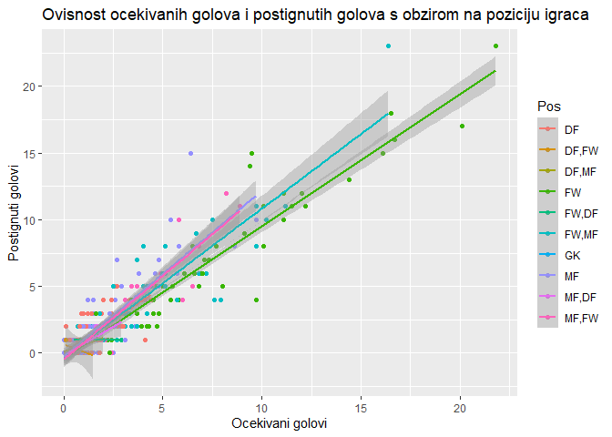

PremierLeagueEDA
================
Maksim Kos
2023-02-06

## **Uvod**

Premier liga je daleko jedna od najzabavnijih i najuzbudljivijih liga na
svijetu. Imaju neke od najboljih menadžera, igrača i navijača. No, ono
što Premier ligu čini istinski interesantnom, je način na koji pojedini
klubovi pristupaju analizi vlastite i protivničke momčadi. Kvalitetna
analiza je postala iznimno važan faktor u razvoju kako momčadi tako i
pojedinca. Analiziranje podataka o igračima i ekipama može dati uvid u
njihove performanse i pomoći u donošenju odluka u različitim
kontekstima, od sportskog menadžmenta do klađenja. Glavni fokus stavljen
je na sezonu 2021-2022. iz koje nam je cilj dobiti uvid u performanse
igrača i ekipa, te na temelju toga donijeti valjane zaključke na naša
postavljena istraživačka pitanja.

## Učitavanje i struktura podataka

Učitavamo csv dokument sa podatcima igrača iz Premier lige za sezonu
2021-2022.

``` r
tablica <- read.csv("Statistika nogometaþa engleske Premier lige.csv",encoding="utf-8")
```

Nakon učitavanja podataka koristimo neke korisne funkcije za dobivanje
uvida u naše podatke.

``` r
#dimezije tablice
dim(tablica)
```

    ## [1] 691  30

``` r
#vraća imena stupaca
names(tablica)
```

    ##  [1] "Player"    "Team"      "Nation"    "Pos"       "Age"       "MP"       
    ##  [7] "Starts"    "Min"       "X90s"      "Gls"       "Ast"       "G.PK"     
    ## [13] "PK"        "PKatt"     "CrdY"      "CrdR"      "Gls.1"     "Ast.1"    
    ## [19] "G.A"       "G.PK.1"    "G.A.PK"    "xG"        "npxG"      "xA"       
    ## [25] "npxG.xA"   "xG.1"      "xA.1"      "xG.xA"     "npxG.1"    "npxG.xA.1"

``` r
#ispis strukture tablice
str(tablica)
```

    ## 'data.frame':    691 obs. of  30 variables:
    ##  $ Player   : chr  "Bukayo Saka" "Gabriel Dos Santos" "Aaron Ramsdale" "Ben White" ...
    ##  $ Team     : chr  "Arsenal" "Arsenal" "Arsenal" "Arsenal" ...
    ##  $ Nation   : chr  "eng ENG" "br BRA" "eng ENG" "eng ENG" ...
    ##  $ Pos      : chr  "FW,MF" "DF" "GK" "DF" ...
    ##  $ Age      : int  19 23 23 23 22 28 28 24 21 20 ...
    ##  $ MP       : int  38 35 34 32 36 27 24 22 33 29 ...
    ##  $ Starts   : int  36 35 34 32 32 27 23 22 21 21 ...
    ##  $ Min      : chr  "2,978" "3,063" "3,060" "2,880" ...
    ##  $ X90s     : num  33.1 34 34 32 30.9 25.9 22.5 21.3 21.3 20.7 ...
    ##  $ Gls      : int  11 5 0 0 7 1 2 1 10 6 ...
    ##  $ Ast      : int  7 0 0 0 4 2 1 3 2 6 ...
    ##  $ G.PK     : int  9 5 0 0 7 1 2 1 10 5 ...
    ##  $ PK       : int  2 0 0 0 0 0 0 0 0 1 ...
    ##  $ PKatt    : int  2 0 0 0 0 0 0 0 0 1 ...
    ##  $ CrdY     : int  6 8 1 3 4 10 6 0 1 3 ...
    ##  $ CrdR     : int  0 1 0 0 0 1 0 0 0 1 ...
    ##  $ Gls.1    : num  0.33 0.15 0 0 0.23 0.04 0.09 0.05 0.47 0.29 ...
    ##  $ Ast.1    : num  0.21 0 0 0 0.13 0.08 0.04 0.14 0.09 0.29 ...
    ##  $ G.A      : num  0.54 0.15 0 0 0.36 0.12 0.13 0.19 0.56 0.58 ...
    ##  $ G.PK.1   : num  0.27 0.15 0 0 0.23 0.04 0.09 0.05 0.47 0.24 ...
    ##  $ G.A.PK   : num  0.48 0.15 0 0 0.36 0.12 0.13 0.19 0.56 0.53 ...
    ##  $ xG       : num  9.7 2.7 0 1 4.8 1.2 2.5 0.7 5.8 7.2 ...
    ##  $ npxG     : num  8.2 2.7 0 1 4.8 1.2 2.5 0.7 5.8 6.5 ...
    ##  $ xA       : num  6.9 0.8 0 0.6 6.8 2.3 1.3 1.9 2.2 3.3 ...
    ##  $ npxG.xA  : num  15.2 3.5 0 1.6 11.6 3.5 3.8 2.6 8 9.8 ...
    ##  $ xG.1     : num  0.29 0.08 0 0.03 0.16 0.05 0.11 0.03 0.27 0.35 ...
    ##  $ xA.1     : num  0.21 0.02 0 0.02 0.22 0.09 0.06 0.09 0.1 0.16 ...
    ##  $ xG.xA    : num  0.5 0.1 0 0.05 0.38 0.14 0.17 0.12 0.37 0.51 ...
    ##  $ npxG.1   : num  0.25 0.08 0 0.03 0.16 0.05 0.11 0.03 0.27 0.31 ...
    ##  $ npxG.xA.1: num  0.46 0.1 0 0.05 0.38 0.14 0.17 0.12 0.37 0.47 ...

Sažete statističke informacije o stupcima tablice

``` r
summary(tablica)
```

    ##     Player              Team              Nation              Pos           
    ##  Length:691         Length:691         Length:691         Length:691        
    ##  Class :character   Class :character   Class :character   Class :character  
    ##  Mode  :character   Mode  :character   Mode  :character   Mode  :character  
    ##                                                                             
    ##                                                                             
    ##                                                                             
    ##                                                                             
    ##       Age              MP            Starts         Min           
    ##  Min.   :15.00   Min.   : 0.00   Min.   : 0.0   Length:691        
    ##  1st Qu.:20.00   1st Qu.: 1.00   1st Qu.: 0.0   Class :character  
    ##  Median :24.00   Median :14.00   Median : 9.0   Mode  :character  
    ##  Mean   :24.49   Mean   :15.17   Mean   :12.1                     
    ##  3rd Qu.:28.00   3rd Qu.:28.00   3rd Qu.:22.0                     
    ##  Max.   :39.00   Max.   :38.00   Max.   :38.0                     
    ##  NA's   :4                                                        
    ##       X90s            Gls              Ast              G.PK       
    ##  Min.   : 0.00   Min.   : 0.000   Min.   : 0.000   Min.   : 0.000  
    ##  1st Qu.: 4.35   1st Qu.: 0.000   1st Qu.: 0.000   1st Qu.: 0.000  
    ##  Median :14.70   Median : 1.000   Median : 1.000   Median : 1.000  
    ##  Mean   :15.26   Mean   : 1.896   Mean   : 1.362   Mean   : 1.742  
    ##  3rd Qu.:23.90   3rd Qu.: 2.000   3rd Qu.: 2.000   3rd Qu.: 2.000  
    ##  Max.   :38.00   Max.   :23.000   Max.   :13.000   Max.   :23.000  
    ##  NA's   :144     NA's   :144      NA's   :144      NA's   :144     
    ##        PK             PKatt             CrdY             CrdR        
    ##  Min.   :0.0000   Min.   :0.0000   Min.   : 0.000   Min.   :0.00000  
    ##  1st Qu.:0.0000   1st Qu.:0.0000   1st Qu.: 0.000   1st Qu.:0.00000  
    ##  Median :0.0000   Median :0.0000   Median : 2.000   Median :0.00000  
    ##  Mean   :0.1536   Mean   :0.1883   Mean   : 2.452   Mean   :0.07861  
    ##  3rd Qu.:0.0000   3rd Qu.:0.0000   3rd Qu.: 4.000   3rd Qu.:0.00000  
    ##  Max.   :6.0000   Max.   :7.0000   Max.   :11.000   Max.   :2.00000  
    ##  NA's   :144      NA's   :144      NA's   :144      NA's   :144      
    ##      Gls.1            Ast.1              G.A              G.PK.1      
    ##  Min.   :0.0000   Min.   : 0.0000   Min.   : 0.0000   Min.   :0.0000  
    ##  1st Qu.:0.0000   1st Qu.: 0.0000   1st Qu.: 0.0000   1st Qu.:0.0000  
    ##  Median :0.0300   Median : 0.0300   Median : 0.1000   Median :0.0300  
    ##  Mean   :0.1104   Mean   : 0.1003   Mean   : 0.2107   Mean   :0.1032  
    ##  3rd Qu.:0.1500   3rd Qu.: 0.1200   3rd Qu.: 0.2900   3rd Qu.:0.1400  
    ##  Max.   :2.0300   Max.   :11.2500   Max.   :11.2500   Max.   :2.0300  
    ##  NA's   :145      NA's   :145       NA's   :145       NA's   :145     
    ##      G.A.PK              xG              npxG              xA        
    ##  Min.   : 0.0000   Min.   : 0.000   Min.   : 0.000   Min.   : 0.000  
    ##  1st Qu.: 0.0000   1st Qu.: 0.100   1st Qu.: 0.100   1st Qu.: 0.100  
    ##  Median : 0.1000   Median : 0.800   Median : 0.750   Median : 0.650  
    ##  Mean   : 0.2034   Mean   : 1.929   Mean   : 1.785   Mean   : 1.301  
    ##  3rd Qu.: 0.2800   3rd Qu.: 2.500   3rd Qu.: 2.400   3rd Qu.: 1.900  
    ##  Max.   :11.2500   Max.   :21.800   Max.   :17.100   Max.   :11.200  
    ##  NA's   :145       NA's   :145      NA's   :145      NA's   :145     
    ##     npxG.xA            xG.1             xA.1             xG.xA     
    ##  Min.   : 0.000   Min.   :0.0000   Min.   :0.00000   Min.   :0.00  
    ##  1st Qu.: 0.300   1st Qu.:0.0200   1st Qu.:0.01000   1st Qu.:0.05  
    ##  Median : 1.600   Median :0.0600   Median :0.06000   Median :0.13  
    ##  Mean   : 3.089   Mean   :0.1372   Mean   :0.09262   Mean   :0.23  
    ##  3rd Qu.: 4.300   3rd Qu.:0.1700   3rd Qu.:0.12000   3rd Qu.:0.33  
    ##  Max.   :27.400   Max.   :4.4800   Max.   :6.50000   Max.   :6.50  
    ##  NA's   :145      NA's   :145      NA's   :145       NA's   :145   
    ##      npxG.1         npxG.xA.1    
    ##  Min.   :0.0000   Min.   :0.000  
    ##  1st Qu.:0.0125   1st Qu.:0.050  
    ##  Median :0.0600   Median :0.130  
    ##  Mean   :0.1301   Mean   :0.223  
    ##  3rd Qu.:0.1600   3rd Qu.:0.310  
    ##  Max.   :4.4800   Max.   :6.500  
    ##  NA's   :145      NA's   :145

Zanima nas koliko u našim podatcima imamo nedostajućih vrijednosti

``` r
colSums(is.na(tablica))
```

    ##    Player      Team    Nation       Pos       Age        MP    Starts       Min 
    ##         0         0         0         0         4         0         0         0 
    ##      X90s       Gls       Ast      G.PK        PK     PKatt      CrdY      CrdR 
    ##       144       144       144       144       144       144       144       144 
    ##     Gls.1     Ast.1       G.A    G.PK.1    G.A.PK        xG      npxG        xA 
    ##       145       145       145       145       145       145       145       145 
    ##   npxG.xA      xG.1      xA.1     xG.xA    npxG.1 npxG.xA.1 
    ##       145       145       145       145       145       145

Uočili smo kako je vrijednos atributa “*Min*” chr tipa podataka što će
za daljnu analizu stvarati probleme. Stoga ćemo atribut “*Min*”
pretvoriti iz chr tipa u numeric tip.

``` r
tablica$Min <- as.numeric(gsub(",", "", tablica$Min))
```

## Eksplorativna analiza podataka(EDA)

### Prvo istraživačko pitanje

Zanima nas postoji li razlika u minutaži mladih igrača između
premierligaških ekipa. Pod mlade igrače smatramo svakog igrača koji ima
manje od 25 godina.

``` r
#filtriramo igrače koji su mlađi od 25 godina
mladiIgrac <- tablica %>% filter(.,tablica$Age<25)
```

Proučimo koje sve ekipe imamo te koliko svaka ekipa ima zabilježenih
igrača.

``` r
ekipe <- factor(tablica$Team)
table(ekipe)
```

    ## ekipe
    ##                 Arsenal             Aston Villa               Brentford 
    ##                      41                      41                      36 
    ##  Brighton & Hove Albion                 Burnley                 Chelsea 
    ##                      35                      32                      31 
    ##          Crystal Palace                 Everton            Leeds United 
    ##                      30                      40                      33 
    ##          Leicester City               Liverpool         Manchester City 
    ##                      32                      35                      33 
    ##       Manchester United        Newcastle United            Norwich City 
    ##                      36                      33                      34 
    ##             Southampton       Tottenham Hotspur                 Watford 
    ##                      30                      35                      39 
    ##         West Ham United Wolverhampton Wanderers 
    ##                      31                      34

#### **Vizualizacija podataka**

Prvo ćemo vizualizirati koliku minutažu dobivaju mladii grači te
raspodjelu po dobi između mladih igrača.

``` r
graf1 <-ggplot(mladiIgrac, aes(x=Min)) + geom_histogram(colour=4,fill="White",bins=50) + ggtitle("Histogram broja odigranih minuta igrača mlađih od 25 godina")

suppressWarnings(print(graf1))
```

<!-- -->

``` r
graf2 <- ggplot(mladiIgrac,aes(x=Age)) + geom_histogram(colour=4,fill="White",bins=9) + ggtitle("Histogram godina mladih igrača") + scale_x_continuous()

print(graf2)
```

<!-- -->

Vidljivo je iz *histograma broja odigranih minuta mladih igraca* da
veliki broj mladih igrača nije odigralo niti minutu na terenu. Stoga
ćemo uzeti u obzir mlade igrače koji su odigrali barem kumulativno u
minutama 3 utakmice tj. 270 minuta.

``` r
#odabiremo igrače koji su sveukupno odigrali više od 270 minuta
mladiIgrac <- mladiIgrac %>% filter(.,Min>=270)

graf3 <-ggplot(mladiIgrac, aes(x=Min)) + geom_histogram(colour=4,fill="White",bins=50) + ggtitle("Histogram broja odigranih minuta igraca mlađih od 25 godina")

suppressWarnings(print(graf3))
```

<!-- -->

Pomoću *boxplota* i *barplota* prikazat ćemo odnos ukupnog broja
odigranih minuta mladih igrača u cijeloj sezoni po ekipi

``` r
#uzimamo tablicu mladiIgrac koju grupiramo po ekipi
bpgraf1 <- mladiIgrac %>% group_by(Team)  %>% ggplot(aes(x=Team,y=Min)) + geom_boxplot()+ theme(axis.text.x = element_text(angle = 90)) +ylab("Ukupno odigranih minuta")

suppressWarnings(print(bpgraf1))
```

<!-- -->

``` r
#uzimamo tablicu mladiIgrac koju grupiramo po ekipi te dodajemo stupac totalMin u kojem se nalazi ukupan broj odigranih minuta mladih igrača za pojedinu ekipu
bargraf2 <- mladiIgrac %>% group_by(Team) %>% summarise(totalMin=sum(Min,na.rm = T))  %>% ggplot(aes(x=Team,y=totalMin)) + geom_bar(stat="identity",colour=4,fill="White") + theme(axis.text.x = element_text(angle = 90)) +ylab("Ukupno odigranih minuta")

bargraf2
```

<!-- -->

Vidljivo je iz oba grafa da minutaža mladih igrača varira od momčadi do
momčadi, no za valjani zaključak moramo se poslužiti statističkim
testovima.

Zanima nas normalnost odigranih minuta kod mladih igrača te ćemo se
poslužiti Anderson-Darlingovim testom na razini značajnosti **⍶=0.05**
koji dopušta ponovljene vrijednosti za razliku od
Kolmogorov-Smirnovljevog testa.

``` r
ad.test(mladiIgrac$Min)
```

    ## 
    ##  Anderson-Darling normality test
    ## 
    ## data:  mladiIgrac$Min
    ## A = 1.9179, p-value = 6.532e-05

Pošto je p-vrijednost manja od 0.05, zaključujemo da broj odigranih
minuta mladih igrača nije normalno distribuiran što je vidljivo također
i iz QQ grafa.

``` r
ggplot(mladiIgrac,aes(sample=Min))+stat_qq()+stat_qq_line()
```

<!-- -->

#### Testiranje hipoteze

Postavljamo hipotezu da su srednje vrijednosti svih kategorija jednake i
odabiremo da je **⍶=0.05.**

-   H0 : medijani svih uzoraka su jednaki

-   H1: barem jedna medijan je različita od ostalih

Pošto imamo više od dvije kategorije točnije 20 kategorija, korstit ćemo
neparametarsku Analizu varijance(**ANOVA**) tj. **Kruskal-Wallisov
test**

``` r
#mlade igrace koji su odigrali manje od 270 minuta smo izbacili te ih grupiramo po ekipi
table(mladiIgrac$Team)
```

    ## 
    ##                 Arsenal             Aston Villa               Brentford 
    ##                      12                       8                      11 
    ##  Brighton & Hove Albion                 Burnley                 Chelsea 
    ##                      10                       3                       8 
    ##          Crystal Palace                 Everton            Leeds United 
    ##                       7                       9                       9 
    ##          Leicester City               Liverpool         Manchester City 
    ##                      13                       7                       5 
    ##       Manchester United        Newcastle United            Norwich City 
    ##                       7                       6                      12 
    ##             Southampton       Tottenham Hotspur                 Watford 
    ##                      11                      10                       8 
    ##         West Ham United Wolverhampton Wanderers 
    ##                       5                       8

Pretpostavka testa je da u svakoj ekipi imamo barem 5 igrača tj. 5
uzoraka. Pošto je Burnley jedina ekipa u kojoj su 3 mlada igrača
odigrala barem 1 minuta, Burnleyu ćemo dodati još dva igrača koji su
odigrali 0 minuta.

``` r
igrac<-tablica %>% filter(Player %in% c("Dara Costelloe","Anthony Gomez Mancini") )
igrac$Min <-0

mladiIgrac <- rbind(mladiIgrac,igrac)
table(mladiIgrac$Team)
```

    ## 
    ##                 Arsenal             Aston Villa               Brentford 
    ##                      12                       8                      11 
    ##  Brighton & Hove Albion                 Burnley                 Chelsea 
    ##                      10                       5                       8 
    ##          Crystal Palace                 Everton            Leeds United 
    ##                       7                       9                       9 
    ##          Leicester City               Liverpool         Manchester City 
    ##                      13                       7                       5 
    ##       Manchester United        Newcastle United            Norwich City 
    ##                       7                       6                      12 
    ##             Southampton       Tottenham Hotspur                 Watford 
    ##                      11                      10                       8 
    ##         West Ham United Wolverhampton Wanderers 
    ##                       5                       8

``` r
#mlade igrace grupiramo po ekipi
igraciPoTimu <- mladiIgrac %>% 
                group_by(Team) 
```

Izračun test-statistike i p-vrijednosti

``` r
kruskal.test(Min ~ Team,data = igraciPoTimu)
```

    ## 
    ##  Kruskal-Wallis rank sum test
    ## 
    ## data:  Min by Team
    ## Kruskal-Wallis chi-squared = 17.522, df = 19, p-value = 0.5545

##### Odluka

p-vrijednost = 0.5545.

Pošto je p-vrijednost \> ⍶, na razini značajnosti ⍶=0.05 ne možemo
odbaciti H0 te zaključujemo da je medijan distribucija svih uzoraka
jednak tj. nema razlike u broju odigranih minuta mladih igrača među
premierligaškim ekipama.

### Drugo istraživačko pitanje

Zanima nas dobivaju li u prosjeku više žutih kartona napadači ili igrači
u veznome redu?

#### Vizualizacija podataka

Zanima nas prvo koje sve nogometne pozicije postoje u tablici

``` r
pozicijeIgraca <- factor(tablica$Pos)
table(pozicijeIgraca)
```

    ## pozicijeIgraca
    ##    DF DF,FW DF,MF    FW FW,DF FW,MF    GK    MF MF,DF MF,FW 
    ##   233     4     9    99     2    62    74   158    11    39

``` r
ggplot(tablica,aes(x=Pos,fill=Pos)) + geom_bar() + geom_text(stat='count', aes(label=..count..), vjust=-1) + ylim(0,240)
```

<!-- -->

Imamo 99 igrača na poziciji FW, te 158 igrača na poziciji MF. Postavlja
se pitanje što je s igračima koji igraju na pozicijama DF,FW ili DF,MF
ili FW,DF ili FW,MF ili MF,DF ili MF,FW.

Odlučili smo se za opciju da samo veznim igračima **MF** pribrojimo
igrače koji igraju dvojake pozicije ali im je MF prirodnija pozicija(tj.
MF je prvi spomenut kao npr. MF,DF), na isti način ćemo pribrojiti
igrače i čistim napadačima **FW**.

``` r
veznjaci <- tablica %>% 
            filter(str_detect(Pos, "MF,")==T | Pos=="MF") %>% 
            select(Player:Min,CrdY)

napadaci <- tablica %>% 
            filter(str_detect(Pos, "FW,")==T | Pos=="FW") %>%
            select(Player:Min,CrdY)

paste("Imamo ukupno",nrow(veznjaci),"veznjaka i ",nrow(napadaci),"napadaca.")
```

    ## [1] "Imamo ukupno 208 veznjaka i  163 napadaca."

``` r
paste("Srednja vrijednost broja žutih kartona veznjaka:",mean(veznjaci$CrdY,na.rm = T),"i standardna devijacija broja žutih kartona veznjaka:",sd(veznjaci$CrdY,na.rm=T))
```

    ## [1] "Srednja vrijednost broja žutih kartona veznjaka: 2.74698795180723 i standardna devijacija broja žutih kartona veznjaka: 2.76709397281686"

``` r
paste("Srednja vrijednost broja žutih kartona napadaca:",mean(napadaci$CrdY,na.rm = T),"i standardna devijacija broja žutih kartona napadaca:",sd(napadaci$CrdY,na.rm=T))
```

    ## [1] "Srednja vrijednost broja žutih kartona napadaca: 1.9375 i standardna devijacija broja žutih kartona napadaca: 2.28775625260399"

``` r
totalYellowCardVeza <- sum(veznjaci$CrdY,na.rm=T)
paste("Veznjaci imaju ukupno:",totalYellowCardVeza,"zutih kartona")
```

    ## [1] "Veznjaci imaju ukupno: 456 zutih kartona"

``` r
totalYellowCardNapad <- sum(napadaci$CrdY,na.rm=T)

paste("Napadaci imaju ukupno",totalYellowCardNapad,"zutih kartona")
```

    ## [1] "Napadaci imaju ukupno 279 zutih kartona"

Prvo ćemo provjeriti dolaze li podatci iz normalne distribucije.

Normalnost podataka možemo provjeriti uz pomoć *histograma.*

``` r
hist3 <- ggplot(veznjaci,aes(x=CrdY)) + geom_histogram(color=4,fill="White",binwidth = 1) +ggtitle("Histogram broja žutih kartona veznih igrača")+xlab("Žuti kartoni") +ylab("Broj žutih kartona")

suppressWarnings(print(hist3))
```

<!-- -->

``` r
hist4 <- ggplot(napadaci,aes(x=CrdY)) + geom_histogram(color=4,fill="White",binwidth = 1) +ggtitle("Histogram broja žutih kartona napadača")+xlab("Žuti kartoni") +ylab("Broj žutih kartona")
suppressWarnings(print(hist4))
```

<!-- -->

Iz *histograma* je vidljivo da podatci ne dolaze iz normalne razdiobe te
da su obje distribucije zakrivljene u desno.

Odlučujemo se za **test o dvije proporcije.**

#### Testiranje hipoteze

Postavljamo hipotezu da igrači veznog reda dobivaju jednak broj žutih
kartona kao i igrači u napadu. Koristimo **Mann-Whitney-Wilcoxonov
test**

Uzorci n1(broj napadača) ≠ n2(broj veznih igrača) te obje distribucije
žutih kartona su jednake(zakrivljene u desno) tj. podatci dolaze iz iste
distribucije

**Hipoteza**

-   H0 : M1=M2 (prosječan broj žutih kartona veznih igrača jednak je
    prosječnom broju žutih kartona napadača)

-   H1 : M1\<M2 (prosječan broj žutih kartona veznih igrača veći je od
    prosječnog broja žutih kartona napadača)

    **⍶=0.05**

Boxplotom ćemo vizualizirati prvenstveno medijan broja žutih kartona
između napadača i igrača veznog reda

``` r
veznjaci$Pos <- "veza"
napadaci$Pos <- "napad"
#kreiranje tablice za prikaz i statistički test
wilcoxDF <- rbind(veznjaci,napadaci)

ggplot(wilcoxDF,aes(x=Pos,y=CrdY))+geom_boxplot() + ylab("Broj žutih kartona") +xlab("Pozicija") 
```

    ## Warning: Removed 61 rows containing non-finite values (stat_boxplot).

<!-- -->

``` r
wilcox.test(CrdY ~ Pos,alternative="less",data=wilcoxDF)
```

    ## 
    ##  Wilcoxon rank sum test with continuity correction
    ## 
    ## data:  CrdY by Pos
    ## W = 9966.5, p-value = 0.004947
    ## alternative hypothesis: true location shift is less than 0

##### Odluka

p-vrijednost = 0.004947 tj. p-vrijednost \< ⍶ tj. odbacujemo H0 te
donosimo zaključak da više žutih kartona dobivaju igrači veznog reda.

### Treće istraživačko pitanje

Određivanje uspješnosti pojedinog igrača na temelju parametara. Pokušat
ćemo vidjeti utjecaj pozicije i očekivanog broja golova na broj
zabijenih golova.

Idemo istražiti tko su najuspješniji igrači u pojedinim
kategorijama(golovi, asistencije, odigrane utakmice…)

#### **Uvid u podataka**

``` r
#filtriranje i sortiranje podataka kako bi se dobili najbolji golgeter i asistent
najviseGolova <- tablica %>% slice_max(Gls)
golgeteri <- najviseGolova$Player
golovi <- unique(najviseGolova$Gls)
paste("Najvise postignutih golova u sezoni 21/22 su imali",golgeteri[1],"i",golgeteri[2],"i to svaki",golovi,"gola")
```

    ## [1] "Najvise postignutih golova u sezoni 21/22 su imali Mohamed Salah i Son Heung-min i to svaki 23 gola"

``` r
najviseAsistencija <- tablica %>% slice_max(Ast)
paste("Najvise asistencija u sezoni 21/22 je imao",najviseAsistencija$Player,"s",najviseAsistencija$Ast,"asistencija")
```

    ## [1] "Najvise asistencija u sezoni 21/22 je imao Mohamed Salah s 13 asistencija"

``` r
#najboljih pet golgetera ne gledajući postignute penale
tablica %>% slice_max(G.PK,n=5)
```

    ##              Player              Team  Nation   Pos Age MP Starts  Min X90s Gls
    ## 1     Son Heung-min Tottenham Hotspur  kr KOR FW,MF  29 35     35 3006 33.4  23
    ## 2     Mohamed Salah         Liverpool  eg EGY    FW  29 35     30 2762 30.7  23
    ## 3        Sadio Mané         Liverpool  sn SEN    FW  29 34     32 2819 31.3  16
    ## 4       Jamie Vardy    Leicester City eng ENG    FW  34 25     20 1806 20.1  15
    ## 5        Diogo Jota         Liverpool  pt POR    FW  24 35     27 2364 26.3  15
    ## 6   Kevin De Bruyne   Manchester City  be BEL    MF  30 30     25 2201 24.5  15
    ## 7 Cristiano Ronaldo Manchester United  pt POR    FW  36 30     27 2456 27.3  18
    ##   Ast G.PK PK PKatt CrdY CrdR Gls.1 Ast.1  G.A G.PK.1 G.A.PK   xG npxG   xA
    ## 1   7   23  0     0    2    0  0.69  0.21 0.90   0.69   0.90 16.4 16.4  8.1
    ## 2  13   18  5     6    1    0  0.75  0.42 1.17   0.59   1.01 21.8 17.0 10.4
    ## 3   2   16  0     0    5    0  0.51  0.06 0.57   0.51   0.57 16.7 16.7  4.4
    ## 4   2   15  0     0    2    0  0.75  0.10 0.85   0.75   0.85  9.5  9.5  1.6
    ## 5   4   15  0     0    3    0  0.57  0.15 0.72   0.57   0.72 16.1 16.1  5.5
    ## 6   8   15  0     0    2    0  0.61  0.33 0.94   0.61   0.94  6.4  6.4  9.5
    ## 7   3   15  3     3    8    0  0.66  0.11 0.77   0.55   0.66 16.5 14.2  3.1
    ##   npxG.xA xG.1 xA.1 xG.xA npxG.1 npxG.xA.1
    ## 1    24.5 0.49 0.24  0.73   0.49      0.73
    ## 2    27.4 0.71 0.34  1.05   0.55      0.89
    ## 3    21.1 0.53 0.14  0.67   0.53      0.67
    ## 4    11.1 0.47 0.08  0.55   0.47      0.55
    ## 5    21.6 0.61 0.21  0.82   0.61      0.82
    ## 6    15.9 0.26 0.39  0.65   0.26      0.65
    ## 7    17.3 0.61 0.11  0.72   0.52      0.64

Kako bi dobili što bolji uvid u ovisnost podataka prikazat ćemo
korelacijsku heatmap-u.

``` r
#uzimamo samo numeričke stupce
heatmapTablica <- select_if(tablica,is.numeric)

#izračun korelacije između dva vektora
corr_mat <-round(cor(heatmapTablica, use = "complete.obs"),2)
melted_corr_mat <- melt(corr_mat)


ggplot(data = melted_corr_mat, aes(x=Var1, y=Var2, fill=value)) +
geom_tile() +
geom_text(aes(Var2, Var1, label = value),color = "black", size = 2)+
theme(axis.text.x = element_text(angle = 90))
```

<!-- -->

#### **Vizualizacija podataka**

Zanima nas utjecaj pozicije na broj zabijenih golova. To je najlakše
prikazati pomoću *Barplota.*

``` r
ggplot(tablica,aes(x=Pos,y=Gls,fill=Pos)) + geom_bar(stat="identity") 
```

    ## Warning: Removed 144 rows containing missing values (position_stack).

<!-- -->

#### Višestruka regresija

Vidimo da najviše postignutih golova imaju napadači te ofenzivni
veznjaci(FW,MF), također i veznjaci imaju dosta zabijenih golova.
Interesantan podatak je taj da braniči imaju više zabijenih golova od
igrača na poziciji MF,FW. To objašnjava pojam modernog nogometa, u kojem
su bekovi sve više uključeniji u ofenzivu.

Zanima nas odnos između očekivanih golova i postignutih golova. Za
najbolji prikaz ovisnosti tih dviju varijabli poslužit će nam *Scatter
plot.*

``` r
#grupiraj
proba <- tablica %>% mutate(tablica,KatPosition = ntile(Pos,3))


#predajemo geom_smooth funkciji koja koristi parametar method=lm (koji koristi linearni model)
ggplot(tablica,aes(x=xG,y=Gls)) + geom_point() + geom_smooth(method=lm)+ ggtitle("Ovisnost očekivanih golova i postignutih golova") +xlab("Očekivani golovi") +ylab("Postignuti golovi")
```

    ## `geom_smooth()` using formula 'y ~ x'

    ## Warning: Removed 145 rows containing non-finite values (stat_smooth).

    ## Warning: Removed 145 rows containing missing values (geom_point).

<!-- -->

``` r
#graf ovisnosti uzevši u obzir i poziciji(postiže se argumentom color=Pos)
ggplot(tablica,aes(x=xG,y=Gls,color=Pos)) + geom_point() + geom_smooth(method=lm)+ ggtitle("Ovisnost očekivanih golova i postignutih golova s obzirom na poziciju igrača ") +xlab("Očekivani golovi") +ylab("Postignuti golovi")
```

    ## `geom_smooth()` using formula 'y ~ x'

    ## Warning: Removed 145 rows containing non-finite values (stat_smooth).

    ## Warning in qt((1 - level)/2, df): NaNs produced

    ## Warning: Removed 145 rows containing missing values (geom_point).

    ## Warning in max(ids, na.rm = TRUE): no non-missing arguments to max; returning
    ## -Inf

<!-- -->

Očito je da broj očekivanih golova ima izražen (i to pozitivan) utjecaj
na izlaznu varijablu tj. broj ostvarenih golova.

``` r
#za predstavljanje kategorijskih varijabli kao ulaz regresijskog modela koristimo  tehniku s dummy varijablama

tablica_dummy = dummy_cols(tablica,select_columns='Pos')

fit_multi_d = lm(Gls ~ xG + Pos_DF + `Pos_DF,FW` + `Pos_DF,MF` + Pos_FW + `Pos_FW,DF`+ `Pos_FW,MF` + Pos_GK+ Pos_MF + `Pos_MF,DF`, tablica_dummy)

summary(fit_multi_d)
```

    ## 
    ## Call:
    ## lm(formula = Gls ~ xG + Pos_DF + `Pos_DF,FW` + `Pos_DF,MF` + 
    ##     Pos_FW + `Pos_FW,DF` + `Pos_FW,MF` + Pos_GK + Pos_MF + `Pos_MF,DF`, 
    ##     data = tablica_dummy)
    ## 
    ## Residuals:
    ##     Min      1Q  Median      3Q     Max 
    ## -5.5370 -0.4508 -0.0159  0.3984  8.2532 
    ## 
    ## Coefficients:
    ##             Estimate Std. Error t value Pr(>|t|)    
    ## (Intercept)  0.03744    0.19015   0.197  0.84398    
    ## xG           1.05171    0.01927  54.565  < 2e-16 ***
    ## Pos_DF      -0.06684    0.20486  -0.326  0.74435    
    ## `Pos_DF,FW` -0.52364    0.60333  -0.868  0.38584    
    ## `Pos_DF,MF` -0.28950    0.54619  -0.530  0.59631    
    ## Pos_FW      -0.70201    0.22686  -3.094  0.00207 ** 
    ## `Pos_FW,DF` -0.82534    0.83187  -0.992  0.32157    
    ## `Pos_FW,MF` -0.10988    0.23772  -0.462  0.64409    
    ## Pos_GK      -0.03744    0.25979  -0.144  0.88546    
    ## Pos_MF      -0.02159    0.21341  -0.101  0.91946    
    ## `Pos_MF,DF` -0.41924    0.39269  -1.068  0.28618    
    ## ---
    ## Signif. codes:  0 '***' 0.001 '**' 0.01 '*' 0.05 '.' 0.1 ' ' 1
    ## 
    ## Residual standard error: 1.147 on 535 degrees of freedom
    ##   (145 observations deleted due to missingness)
    ## Multiple R-squared:  0.8782, Adjusted R-squared:  0.8759 
    ## F-statistic: 385.8 on 10 and 535 DF,  p-value: < 2.2e-16

Iz prilagođeng koeficijenta determinacije možemo 87.82% varijance u
ostvarenim golovima pripisati poziciji igrača i očekivanim golovima.

``` r
#reziduali u ovisnosti o procjenama modela
plot(fit_multi_d$fitted.values,fit_multi_d$residuals) 
```

<!-- -->

``` r
#Anderson-Darling test na normalnost 
ad.test(rstandard(fit_multi_d))
```

    ## 
    ##  Anderson-Darling normality test
    ## 
    ## data:  rstandard(fit_multi_d)
    ## A = 19.2, p-value < 2.2e-16

Na temelju Anderson-Darlingovog testa ne možemo odbaciti Nultu hipotezu
da reziduali ne odstupaju od normalnosti.

### Četvrto istraživačko pitanje

Doprinose li sveukupnom uspjehu svoga tima više “domaći”(tj. igrači
engleske nacionalnosti) igrači ili strani igrači

#### Vizualizacija podataka

  

Također zanima nas omjer igrača engleske nacionalnosti u Premier ligi i
ostalih nacionalnosti

``` r
#odabiremo samo igrače engleske nacionalnosti
englezi <- tablica %>% filter(str_detect(Nation,"eng")) %>% select(Player:Nation)
#odabiremo igrače koji nisu engleske nacionalnosti
ostali <- tablica %>% filter(!str_detect(Nation,"eng")) %>% select(Player:Nation)

englezi$Nation <- "England"
ostali$Nation <- "restOfTheWorld"

engleziStranci <- rbind(englezi,ostali)

#vizualizacija omjera engleskih igrača i ostalih igrača
ggplot(engleziStranci,aes(x=Nation,fill=Nation)) + geom_bar() + geom_text(stat='count', aes(label=..count..), vjust=-1) + ylim(0,440)
```

<!-- -->

Kao doprinos timu u obzir uzimamo svekupune golove i asistencije
ostvarene od igrača jer stupac *golovi i asistencije po 90 minuta* ne
daju vjerodostojan prikaz pošto npr. igrač Liverpool-a Neco Williams ima
najveću vrijednost *Golova i asistencija po 90 minuta* jer je ostvario 1
asistenciju u svojih 8 minuta cjelokupne igre u cijeloj sezoni, a takvih
igrača ima dosta.

Također utjecajem ili doprinosom momčadi smatramo ako igrač ima barem
jedan gol ili asistenciju tj. vrijednost stupca *goloviAsistencije* je
veća od 0

``` r
#dodavanje novog stupca u kojem su pojedinom igraču zbrojeni i golovi i asistencije
utjecajIgraca <- tablica %>% mutate(GoloviAsistencije=Gls+Ast)
utjecajIgraca$Nation <- ifelse(str_detect(utjecajIgraca$Nation,"eng"),"eng","restOfTheWorld")
utjecajIgraca$Nation <- as.factor(utjecajIgraca$Nation)
```

``` r
#izbacit cemo igrace koji nisu imali nikakav utjecaj na ekipu neoviseno o državljanstvu tj. igraci koji imaju sveukupno nula golova i asistenicja
utjecajIgraca <- utjecajIgraca %>% filter(GoloviAsistencije>0) %>%group_by(Team,Nation)
```

``` r
kontigencijskaTablica <- utjecajIgraca %>% select(Player,Team,Nation,GoloviAsistencije)
kontigencijskaTablica <-kontigencijskaTablica  %>% summarise(doprinos=sum(GoloviAsistencije))
```

    ## `summarise()` has grouped output by 'Team'. You can override using the
    ## `.groups` argument.

Prikazat ćemo koliko kojem timu doprinose njegovi engleski igrači i
igrači ostalih nacionalnosti.

``` r
ggplot(kontigencijskaTablica,aes(x=Team,y=doprinos,fill=Nation)) + geom_bar(stat="identity",position = "dodge") + theme(axis.text.x = element_text(angle = 90)) +ylab("Ukupan doprinos")
```

<!-- -->

Iz grafa je vidljivo da veći doprinos ekipama donose strani igrači što
nas ne bi trebalo ni čuditi pošto je u engleskoj ligi 414 stranih igrača
dok je 277 domaćih igrača od kojih je veliki broj mladih igrača bez
ikakve minutaže. Da bi vidjeli doprinose li uspjehu svoje momčadi više
domaći ili strani igrači provest ćemo **Test nezavisnosti**

``` r
#izrada kontigencijske tablice u kojoj su retci nacionalnosti(englezi i ostali), a stupci su pojedine ekipe
kontigencijskaTablica <- kontigencijskaTablica %>% pivot_wider(names_from = Team,values_from=doprinos)

kontigencijskaTablica
```

    ## # A tibble: 2 x 21
    ##   Nation        Arsenal `Aston Villa` Brentford `Brighton & Ho~` Burnley Chelsea
    ##   <fct>           <int>         <int>     <int>            <int>   <int>   <int>
    ## 1 eng                37            46        20               17      29      49
    ## 2 restOfTheWor~      64            46        59               53      29      78
    ## # ... with 14 more variables: `Crystal Palace` <int>, Everton <int>,
    ## #   `Leeds United` <int>, `Leicester City` <int>, Liverpool <int>,
    ## #   `Manchester City` <int>, `Manchester United` <int>,
    ## #   `Newcastle United` <int>, `Norwich City` <int>, Southampton <int>,
    ## #   `Tottenham Hotspur` <int>, Watford <int>, `West Ham United` <int>,
    ## #   `Wolverhampton Wanderers` <int>

#### Testiranje hipoteze

-   H0: utjecaj igrača po državljanstvu **nezavisan** je od ekipe u
    kojoj igra

-   H1: utjecaj igrača po državljanstvu **zavisan** je od ekipe u kojoj
    igra

    **⍶=0.05**

``` r
#moramo stupac "Nation" izbaciti jer njegove vrijednosti su stringovi
chisq.test(kontigencijskaTablica[,-1])
```

    ## 
    ##  Pearson's Chi-squared test
    ## 
    ## data:  kontigencijskaTablica[, -1]
    ## X-squared = 144.13, df = 19, p-value < 2.2e-16

##### Odluka

p-vrijednost je \< ⍶ stoga odbacujemo H0 u korist H1, što je vidljivo i
iz barplot-a u kojem od 20 ekipa u Premier ligi niti jedna ekipa nema
podjednak utjecaj engleskih i stranih igrača.

**Drugi pristup**

Test o proporciji, tj znamo iz gore navedenog barplota da u 2 od 20
ekipa veći utjecaj imaju engleski igrači dok u ostali 16 od 20 ekipa
imaju strani igrači, a u ostale 2 ekipe utjecaj je podjednak.

``` r
#kreiramo novi stupac doprinos u kojem zapisujemo donose li svome timu više strani ili domaći igrači
test_proporcije <- utjecajIgraca %>% select(Team,Nation,GoloviAsistencije) %>% summarise(doprinos=sum(GoloviAsistencije))
```

    ## `summarise()` has grouped output by 'Team'. You can override using the
    ## `.groups` argument.

``` r
test_proporcije <- test_proporcije %>% pivot_wider(names_from = Nation,values_from = doprinos)


test_proporcije <- test_proporcije %>% mutate(.,doprinos=ifelse(eng>restOfTheWorld,"ENG",ifelse(eng<restOfTheWorld,"restOfTheWorld","noDifference")))

test_proporcije
```

    ## # A tibble: 20 x 4
    ## # Groups:   Team [20]
    ##    Team                      eng restOfTheWorld doprinos      
    ##    <chr>                   <int>          <int> <chr>         
    ##  1 Arsenal                    37             64 restOfTheWorld
    ##  2 Aston Villa                46             46 noDifference  
    ##  3 Brentford                  20             59 restOfTheWorld
    ##  4 Brighton & Hove Albion     17             53 restOfTheWorld
    ##  5 Burnley                    29             29 noDifference  
    ##  6 Chelsea                    49             78 restOfTheWorld
    ##  7 Crystal Palace             21             60 restOfTheWorld
    ##  8 Everton                    38             33 ENG           
    ##  9 Leeds United               25             43 restOfTheWorld
    ## 10 Leicester City             61             47 ENG           
    ## 11 Liverpool                  28            137 restOfTheWorld
    ## 12 Manchester City            41            118 restOfTheWorld
    ## 13 Manchester United          24             78 restOfTheWorld
    ## 14 Newcastle United           23             41 restOfTheWorld
    ## 15 Norwich City                6             31 restOfTheWorld
    ## 16 Southampton                31             36 restOfTheWorld
    ## 17 Tottenham Hotspur          30             83 restOfTheWorld
    ## 18 Watford                     4             55 restOfTheWorld
    ## 19 West Ham United            38             66 restOfTheWorld
    ## 20 Wolverhampton Wanderers     5             52 restOfTheWorld

#### Testiranje hipoteze

Postavljamo hipotezu da su proporcije doprinosa engleskih igrača svojoj
ekipi jednake proporciji doprinosa stanih igrača svojoj ekipi i
odabiremo da je **⍶=0.05.**

-   H0: p1 = p2

-   H1: p1 \> p2

``` r
#p1 je omjer ekipa kojima više doprinose strani igrači i svih ekipa u ligi
p1 = sum(test_proporcije$doprinos=="restOfTheWorld") / nrow(test_proporcije)

#p2 je omjer ekipa kojima više doprinose domaći igrači i svih ekipa u ligi
p2 = sum(test_proporcije$doprinos=="ENG") / nrow(test_proporcije)

p1
```

    ## [1] 0.8

``` r
p2
```

    ## [1] 0.1

``` r
prop.test(x=c(sum(test_proporcije$doprinos=="restOfTheWorld"),sum(test_proporcije$doprinos=="ENG")),n=c(nrow(test_proporcije),nrow(test_proporcije)),alternative = "greater")
```

    ## 
    ##  2-sample test for equality of proportions with continuity correction
    ## 
    ## data:  c(sum(test_proporcije$doprinos == "restOfTheWorld"), sum(test_proporcije$doprinos == "ENG")) out of c(nrow(test_proporcije), nrow(test_proporcije))
    ## X-squared = 17.071, df = 1, p-value = 1.801e-05
    ## alternative hypothesis: greater
    ## 95 percent confidence interval:
    ##  0.4660998 1.0000000
    ## sample estimates:
    ## prop 1 prop 2 
    ##    0.8    0.1

##### Odluka

Pošto je p-vrijednost \< ⍶ odbacujemo H0 u korist H1 te možemo donijeti
zaključak kako više svome timu doprinose strani igrači, što nas ne bi
trebalo čuditi pošto je stranih igrača puno više u samoj ligi nego
domaćih.

### Peto istraživačko pitanje

Zanima nas realiziraju li napadači u engleskoj premier ligi svoje šanse
ispred gola.

#### Filtriranje podataka

Odabiremo napadače(FW) i igrače kojima je napad prirodna pozicija
(FW,\_\_\_)

``` r
napadaci5 <- tablica %>% 
            filter(str_detect(Pos, "FW,")==T | Pos=="FW" ) %>%
            filter(Gls>=1 | xG>=0.1) %>%
            select(Player:Min,Gls,xG)

#izbacujemo napadače koji imaju xG ili Gls vrijednost postavljene na NA
napadaci5 <- na.omit(napadaci5)
```

#### Vizualizacija podataka

Zanima nas dolaze li podatci vezani uz očekivani broj golova i zabijeni
broj golova iz normalne distribucije

``` r
histZabGol1 <- ggplot(napadaci5,aes(x=Gls)) + geom_histogram(bins=20,colour=4,fill="White") + xlab("Zabijeni golovi") + ggtitle("Histogram zabijenih golova napadača")

histZabGol2 <- ggplot(napadaci5,aes(x=xG)) + geom_histogram(bins=20,colour=4,fill="White") + xlab("Očekivani golovi") + ggtitle("Histogram očekivanih golova napadača")

grid.arrange(histZabGol1,histZabGol2,ncol=2)
```

<!-- -->

Iz oba grafa je vidljivo da podatci ne dolaze iz normalne distribucije.

``` r
ad.test(napadaci5$Gls)
```

    ## 
    ##  Anderson-Darling normality test
    ## 
    ## data:  napadaci5$Gls
    ## A = 5.2061, p-value = 6.245e-13

``` r
ad.test(napadaci5$xG)
```

    ## 
    ##  Anderson-Darling normality test
    ## 
    ## data:  napadaci5$xG
    ## A = 3.8381, p-value = 1.28e-09

Vidimo da je u oba testa p-vrijednost manja od ⍶=0.05, stoga odbacujemo
pretpostavku da podatci dolaze iz normalne distribucije.

Također zanima nas jednakost srednjih vrijednosti broja očekivanih
golova napadača i broja ostvarenih golova napadača. To možemo lako
prikazati pomoću boxplot-a.

``` r
boxplotGls <- ggplot(napadaci5, aes(y=Gls)) + geom_boxplot(fill="white") + ggtitle("Box plot ostvarenih golova")

boxplotxG <- ggplot(napadaci5, aes(y=xG)) + geom_boxplot(fill="white") +ggtitle("Box plot očekivanih golova")

grid.arrange(boxplotGls,boxplotxG,ncol=2)
```

<!-- -->

#### Testiranje hipoteze

Pošto podatci ne dolaze iz normalne distribucije, koristit ćemo
Wilcoxonov test. Također treba uzeti i u obzir da govorimo o poziciji
napadača

-   H0: broj ostvarenih golova jednak je broju očekivanih golova

-   H1: broj ostvarenih golova je različit od broja očekivanih golova

    **⍶=0.05**

``` r
wilcox.test(napadaci5$Gls,napadaci5$xG )
```

    ## 
    ##  Wilcoxon rank sum test with continuity correction
    ## 
    ## data:  napadaci5$Gls and napadaci5$xG
    ## W = 7074, p-value = 0.277
    ## alternative hypothesis: true location shift is not equal to 0

##### Odluka

Pošto je p-vrijednost=0.277 \> ⍶=0.05, ne možemo odbaciti Nultu
hipotezu, stoga možemo donijeti zaključak kako napadači u Premier ligi
realiziraju svoje šanse pred golom.

## Zaključak

Eksploratorna analiza podataka o statistikama igrača engleske premier
lige pokazala je da nema razlike u broju odigranih minuta mladih igrača
tj. svi timovi stavljaju važnost na razvitak i razvoj svojih mladih
igrača, da igrači veznog reda igraju žustrije nego igrači u napadu pa
samim time dobivaju više žutih kartona. Doprinos stranih igrača je
izraženiji u premierligaškim klubovima te da napadači ostvaruju svoje
šanse pred golom.

Ova analiza može pružiti važne informacije za trenere, menadžere i
analitičare u njihovim odlučivanjima o strategiji, odabiru igrača i
ocjenjivanju uspješnosti. Međutim, potrebna su dodatna istraživanja kako
bi se utvrdili točni utjecaji i metrike za određivanje uspješnosti
pojedinačnih igrača pošto metrike za npr. poziciju golmana ne postoje u
podatcima.
